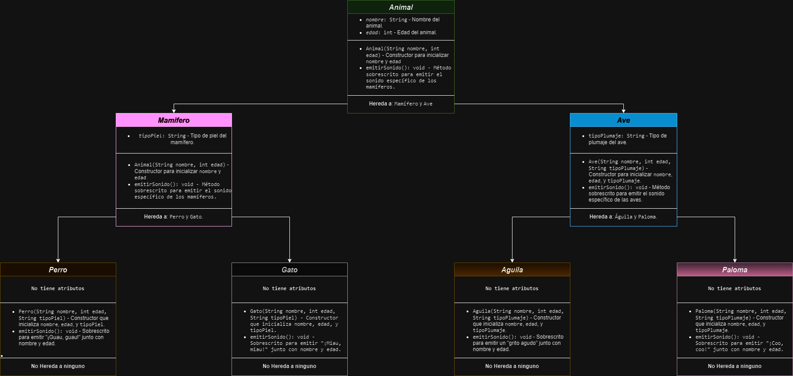

# Ejemplo de Herencia en Programación Orientada a Objetos - Animales

Este proyecto es un ejemplo de implementación de herencia en programación orientada a objetos usando Java. La estructura incluye una clase base `Animal` y varias clases derivadas (`Mamifero`, `Ave`, `Perro`, `Gato`, `Aguila`, y `Paloma`). Cada clase representa un tipo específico de animal, heredando características comunes de `Animal` y especializando el método `emitirSonido()` para emitir un sonido característico de cada animal.

## Descripción del Código

- **Animal**: Clase base con atributos `nombre` y `edad`, y un método `emitirSonido()` que puede ser sobrescrito por las subclases para emitir un sonido específico junto con el nombre y la edad del animal.
- **Mamifero** y **Ave**: Subclases de `Animal` que representan características generales de mamíferos y aves, respectivamente, e incluyen atributos adicionales (`tipoPiel` para mamíferos y `tipoPlumaje` para aves).
- **Perro** y **Gato**: Subclases de `Mamifero` que representan animales específicos con su propio sonido característico.
- **Aguila** y **Paloma**: Subclases de `Ave` que representan aves específicas con sus sonidos únicos.

La clase principal `App` crea instancias de cada tipo de animal y llama al método `emitirSonido()` para mostrar el sonido, nombre, edad, y características adicionales de cada uno.

## Diagrama UML



## Ejecución del Código en Consola sin Compilador

1. Asegúrate de tener `javac` y `java` instalados en tu sistema (Java Development Kit - JDK).
2. Guarda el código en un archivo llamado `App.java`.
3. Abre una terminal y navega hasta la ubicación del archivo `App.java`.

### Compilación del Código

En la terminal, ejecuta el siguiente comando para compilar el archivo:

```bash
javac App.java
```

Esto generará archivos `.class` para cada clase en el mismo directorio.

### Ejecución del Código

Después de compilar el archivo, puedes ejecutar la clase principal `App` con el siguiente comando:

```bash
java App
```

Al ejecutar este comando, deberías ver el siguiente resultado en la consola, que muestra el nombre, edad, y características específicas de cada animal junto con su sonido:

```
Bobby de 5 años, un perro con Pelo corto, ladra: ¡Guau, guau!
Mish de 3 años, un gato con Pelo largo, maúlla: ¡Miau, miau!
Aquila de 4 años, un águila con Plumaje marrón, emite un grito agudo.
Pidgey de 2 años, una paloma con Plumaje blanco, arrulla: ¡Coo, coo!
```

Este resultado muestra los sonidos específicos de cada animal junto con su nombre, edad y otras características según su clase.

## Información de Estudiante

Nombre: Juan David Pérez Numa  
Correo: juperez49@unisalle.edu.co  
Código: 4v241102  